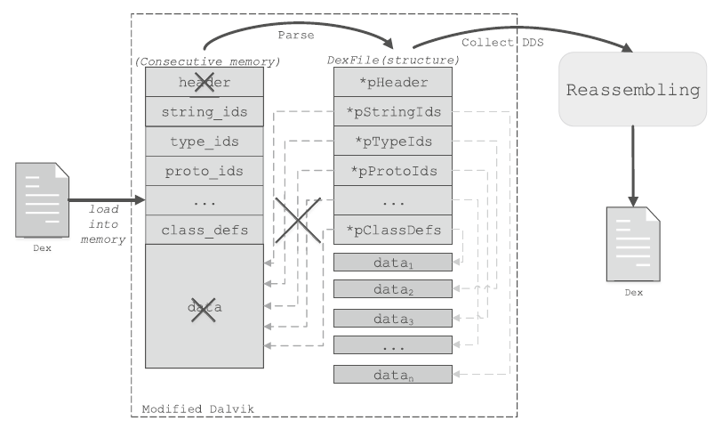
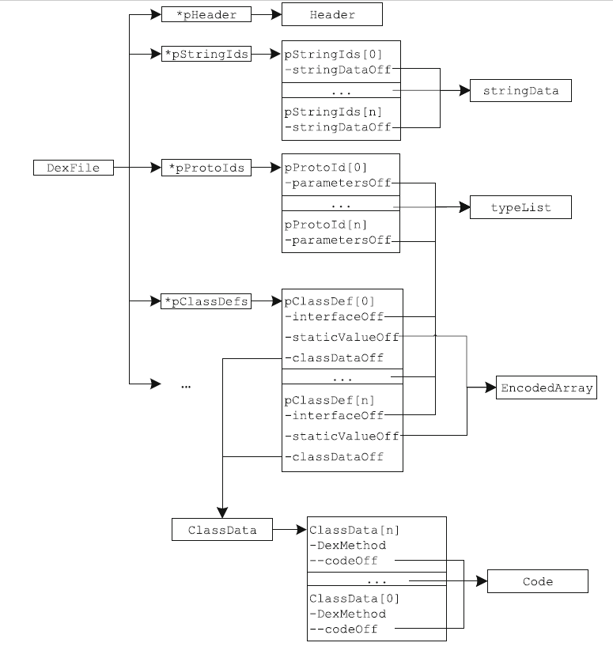
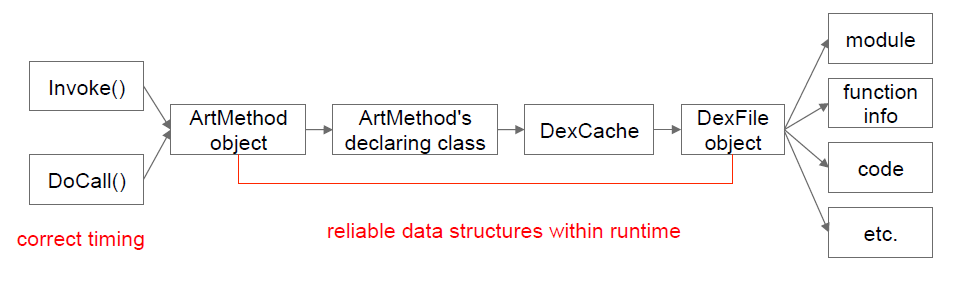
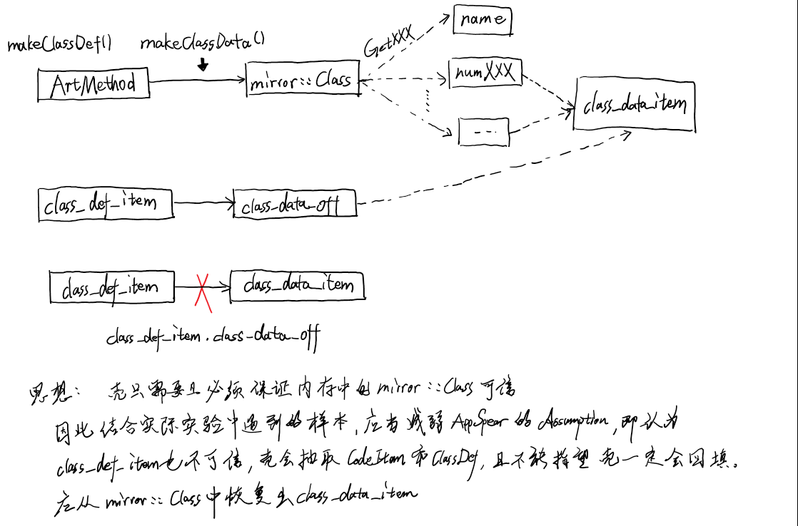
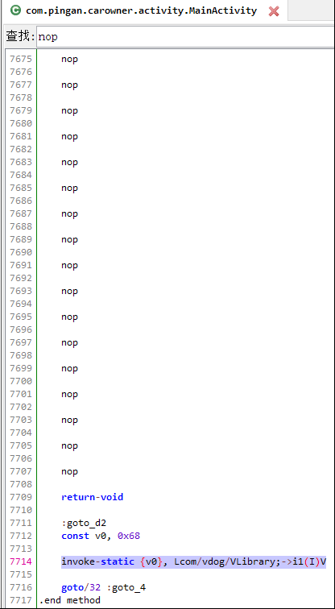
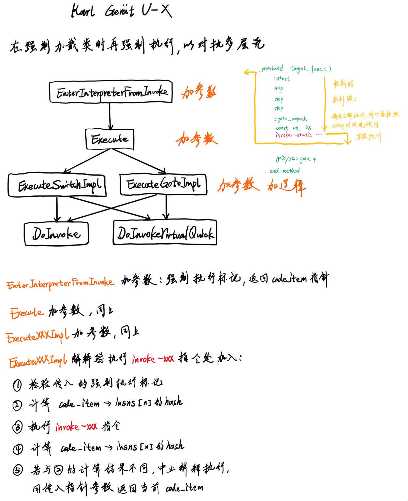
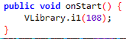
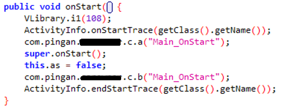
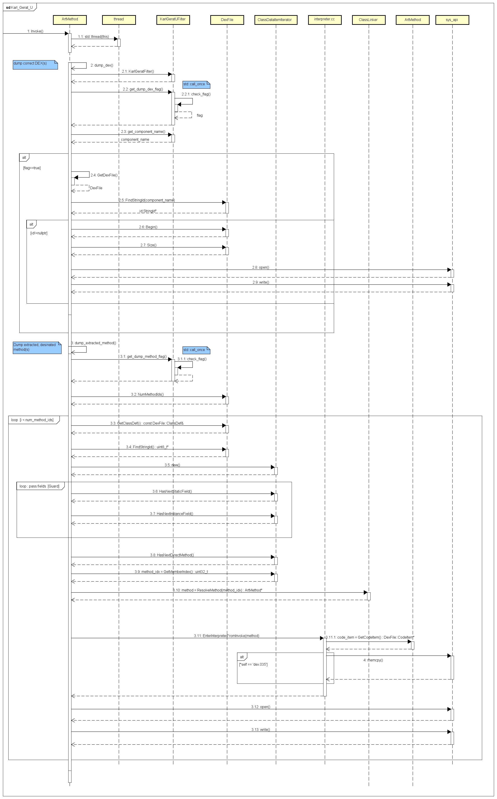

# Karl Gerät U
虽然市面上已经有太多开源脱壳机了，但是还是按照自己思路（和其他脱壳机不一样）实现了脱壳机Karl Gerat U。一方面作为练习，另一方面进行了一些创新。名称来源为“卡尔”臼炮，因为“击溃防线≈脱壳“

## 学术界脱壳工作
首先阅读了一些文献，印象比较深的有如下两篇。
### AppSpear
AppSpear: Bytecode Decrypting and DEX Reassembling for Packed Android Malware（RAID-2015）

该工作首先对当时的加壳恶意软件进行了大规模研究，得出了当时恶意软件中加壳的比例；其次实现了AppSpear，一种自动化脱壳ROM，可以完全对抗第二型壳，部分对抗第三型壳。也是学术界首个能对抗第三型壳的自动化脱壳工具。

该工作通过修改AOSP源码插装系统解释器相关函数，在解释器执行指定的方法时，主动加载应用的所有类和方法，并收集它们的DEX数据结构于内存中。最后借助收集到的DEX数据结构，计算出类和方法的偏移、数量、文件头部等信息，在内存中重新构建DEX文件并写入手机内部存储。

对于加壳应用，文章有一个假定（Assumption），DEX文件的Header结构、data结构（存放类和方法的字节码、字符串等的结构），也就是图1中画了“×”的结构，是易于被篡改的。而index结构（索引字段），也就是图中没画“×”的结构是不能篡改的。这是一个合理的假定，因为Android应用的运行依赖于Android系统虚拟机，因此壳还是需要支持Android系统虚拟机的一些功能，Android系统虚拟机的功能又依赖于DEX文件中的索引字段，因此索引字段不便于篡改。

图1 AppSpear对于加壳应用的假设

AppSpear收集内存DEX数据结构的方式如图2所示，主要借助一些指针数据，根据这些指针，就可以找到内存中的真实数据和地址。

图2 AppSpear收集DEX数据结构的方式

值得注意的是，该工作首次提出了内存DEX数据结构收集和内存DEX重组的概念，并把脱壳点设置在了方法执行时这样一个非常深的位置，使得脱壳的粒度更加细，能够完全对抗二型壳和部分三型壳。
AppSpear基于AOSP源码修改，支持当时主流的Google Nexus真机设备，包括Galaxy Nexus和Nexus 4。

AppSpear实际上尚有诸多局限性，RAID-2015发表的AppSpear仅支持Dalvik虚拟机，之后在2017年又在期刊上发表，增加了对基于Android-5.0.1的ART的支持，并且做了开源。
尽管AppSpear合理选择性地信任和不信任内存中的数据结构，但是内存重组DEX开销太大、成功率低。基于开源代码，复现发现，对于体积超过10MB的商业加壳样本，极大概率无法脱壳。
在解释器相关函数插装的做法过于被动，因为有很多函数并不会经过解释器解释执行，因而无法完全对抗第三型壳。
强制遍历并加载所有类的算法过于朴素，不仅开销大，而且还会被壳采用“加入含退出代码（exit(0);）正常情况下不会被调用的空类”的方式对抗。

### DroidUnpack
Things You May Not Know About Android (Un)Packers: A Systematic Study based on Whole-System Emulation(NDSS-2018)

作者认为尽管APP加壳的趋势在不断上升，学术界的研究并没有对于Android APP加壳全面的系统性的研究。因此作者决定对这个问题进行系统研究，该文也是学术界第一篇对这个问题有全面研究的综述。
这是一篇实践型综述，方法论主要是通过在ArtMethod::Invoke和DoCall函数上插装来整体dump DEX，并且使用基于qemu的虚拟机来辅助监控壳的行为，如图3所示。不过本文的创新点和意义并不在方法论上，而是在借助方法论获得的发现上。

图3 DroidUnpack实现示意图

主要有如下4点：

(1)恶意软件中，自定义壳最多，除此之外，梆梆最多

(2)恶意软件加壳的比例并不是逐年上涨的

(3)加壳可能会引入安全漏洞

(4)Android加壳的进化

虽然学术界显然对于这些发现给予了认可，但是实际上这几点对于实际脱壳问题的解决并没太多价值，甚至是错误的，比如作者在(4)中作者认为，预计未来Android加壳会朝着更多native代码的方向发展、可能会呈现出和PC端程序壳类似的发展趋势，例如层数变得更多，层之间的关系变得更复杂。此外甚至可能会朝着虚拟化壳的方向发展。实际上这个观点并不正确，因为在该论文发表的2年前，360的DEXVMP壳就已经非常普遍了。

总的来说，学术界的脱壳工作不能算靠谱，而且在这篇文章之后，Android脱壳研究的方向就被带到透明监控上了，而且越走越底层，甚至有用硬件脱壳的（Happer）。**这里不予置评**

## Karl Gerät U设计
### 总体思想

### 类强制加载
Karl Gerat U的类强制加载机制使用的是EnsureInitialize函数，该函数调用InitializeClass函数，InitializeClass函数会获取类的<clinit>方法的ArtMethod对象并调用其Invoke函数实现调用
（<clinit>函数其实就是类中的static{ }代码块，Kiwi样本将解密字节码并修改描述符的逻辑写在static{}代码块中）
理论上只要执行了<clinit>方法，真实的字节码就会被还原到内存中，收集即可
没有必要写Java层的代码，所有实现在C++

### 强制执行
该机制用于对抗多层壳，如下图所示

Lcom/pingan/c******r/activity/MainActivity;onStart()V强制执行效果：

执行前（level 2）

执行后

<!-- ### 序列图
 -->